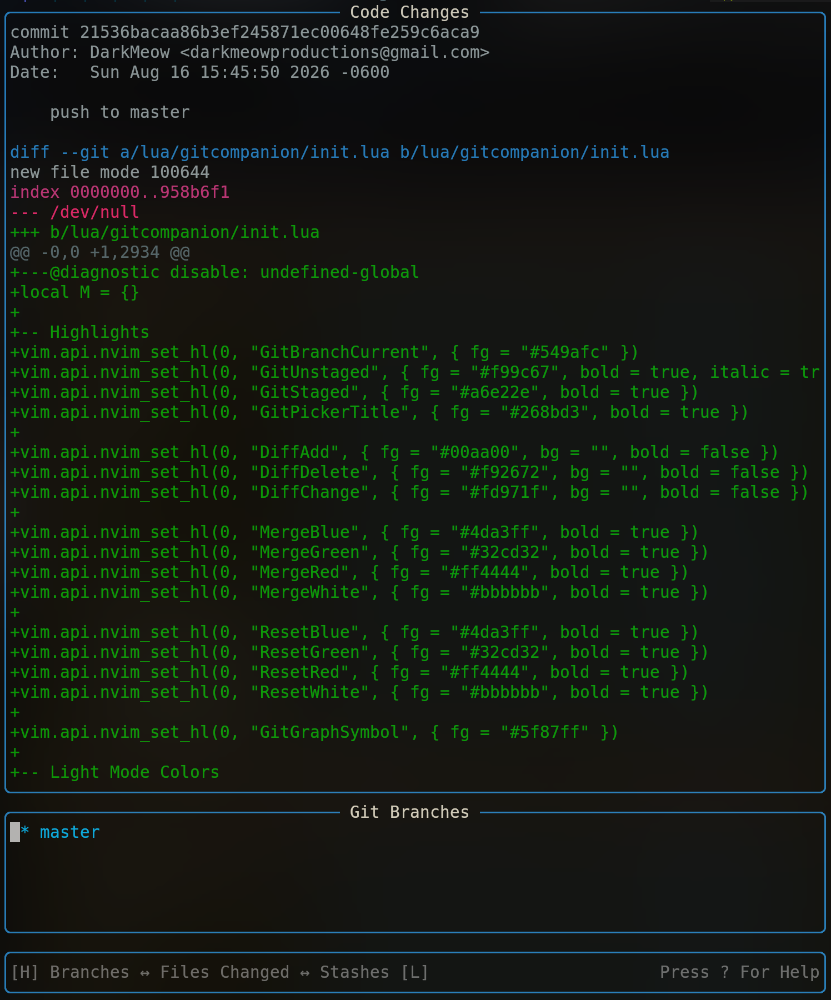
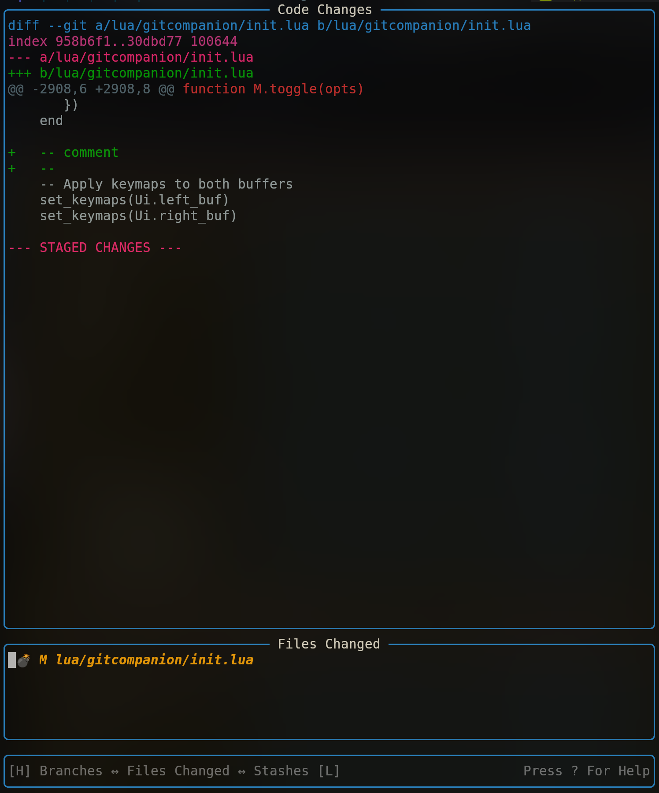
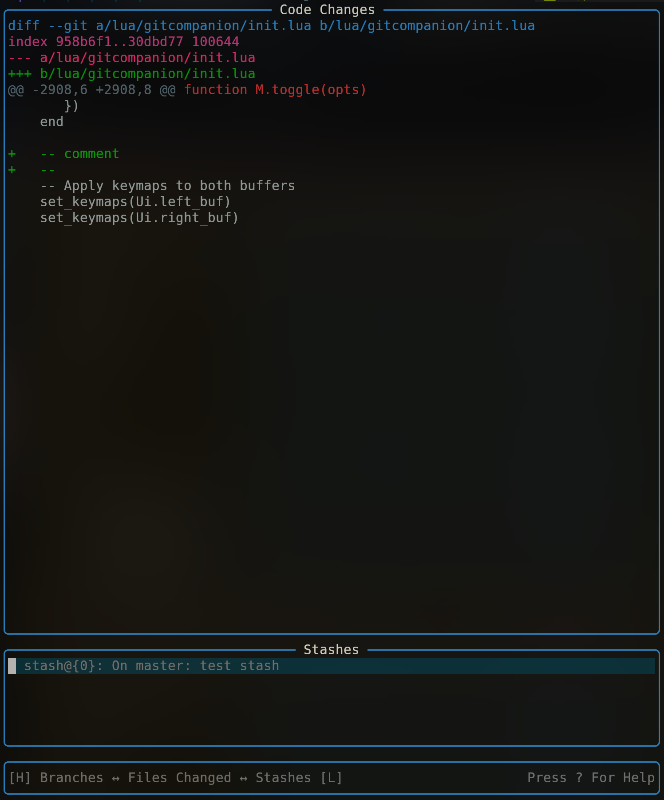
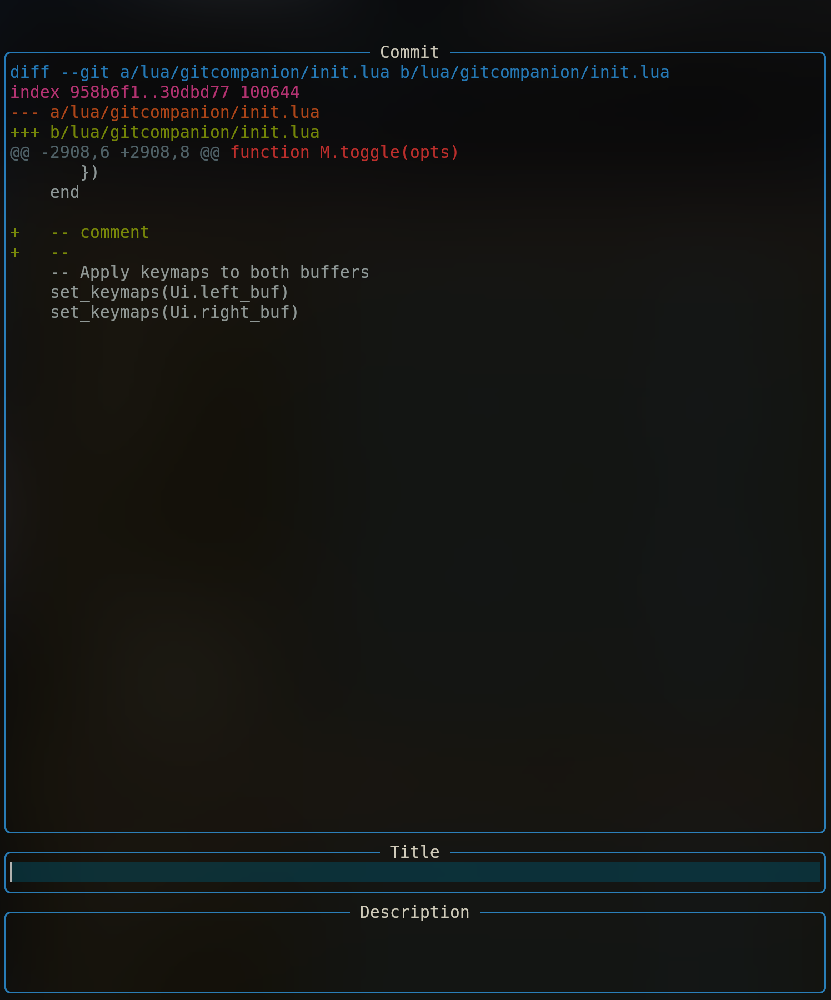
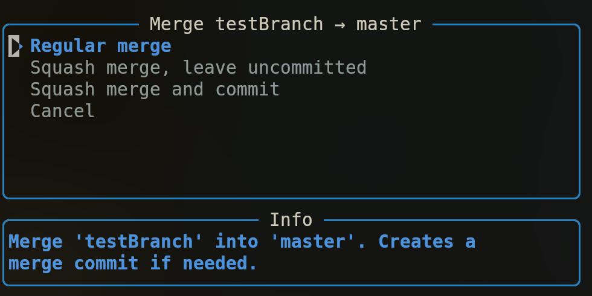
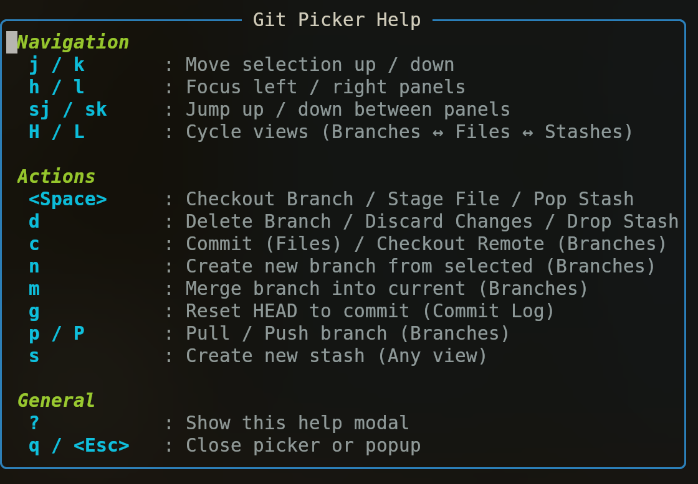

# GitCompanion.nvim

A lightweight, terminal-native Git interface floating window for Neovim. Inspect diffs, manage branches, stage modified files, manage stashes, and handle merges or commits without leaving your neovim editor.



---

## Features

- **Multi-View Interface:** Fast cycling across **Branches**, **Files Changed**, and **Stashes** views.
- **Live Code Changes Panel:** Instant diff previewing for commits, staged/unstaged changes, and stashes.
- **Streamlined Branch Operations:** Create, checkout, merge (regular, squash), pull, and push branches directly from floating UI modals.
- **Commit & Stash Workflows:** Built-in title/description commit dialogs and quick stash creation/popping.
- **Keyboard-First Navigation:** Standard Vim motions (`j`, `k`, `h`, `l`) and explicit hotkeys for quick execution.
- **Help Modal:** Instant keymap reference available anywhere via `?`.

---

## Screenshots

### File Status & Diffs

View staged/unstaged files and preview line diffs in real time.



---

### Stash Management

Inspect saved stash items alongside their code modifications.



---

### Commit Creation Modal

Dedicated floating modal to write commit titles and detailed descriptions.



---

### Interactive Branch Operations

Create new branches or launch regular/squash merge workflows seamlessly.

|              Branch Creation              |          Interactive Merging           |
| :---------------------------------------: | :------------------------------------: |
|  |  |

---

### Built-in Keymap Help Modal

Press `?` inside any window to toggle the interactive cheat sheet.



---

## Installation

### Using [lazy.nvim](https://github.com/folke/lazy.nvim)

```lua
{
  'Darkskittlz/GitCompanion',
  dependencies = {
    'nvim-lua/plenary.nvim', -- Optional: include if your plugin relies on plenary utilities
  },
  keys = {
    { '<leader>gc', '<cmd>GitCompanion<cr>', desc = 'Toggle GitCompanion' },
  },
  opts = {},
}
```
